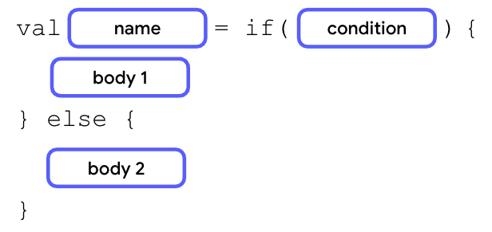

Si los cuerpos solo contienen una expresión o un valor de retorno, puedes quitar las llaves para que el código sea más conciso.

## Ejemplos

````kotlin
fun main() {
    val trafficLightColor = "Amber"

    val message = when(trafficLightColor) {
        
        "Red" -> "Stop"
        
        "Yellow", "Amber" -> "Proceed with caution."
        
        "Green" -> "Go"
        
        else -> "Invalid traffic-light color"
        
    }
    
    println(message)
    
}

````


