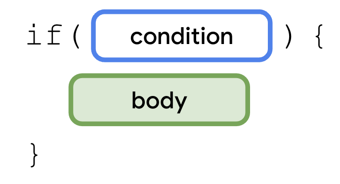
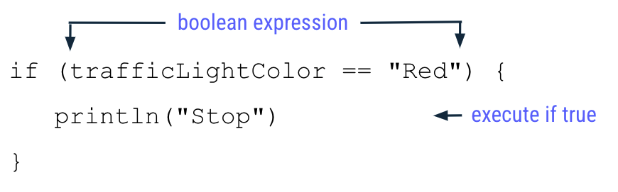
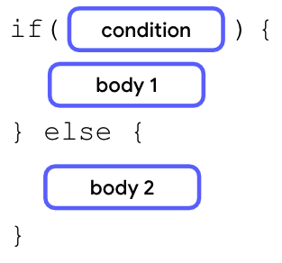
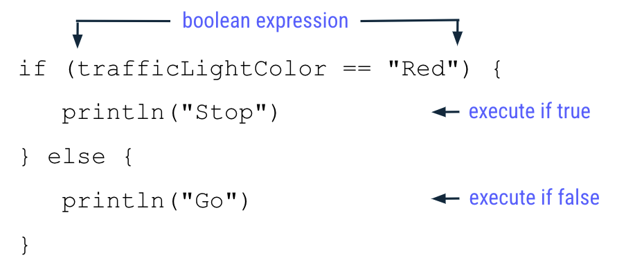
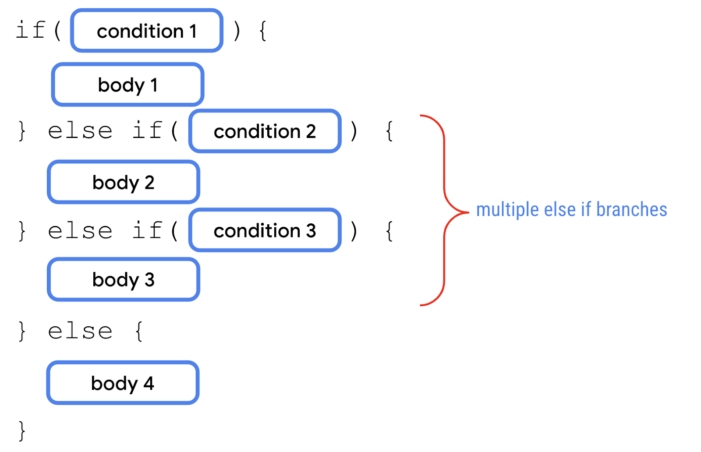
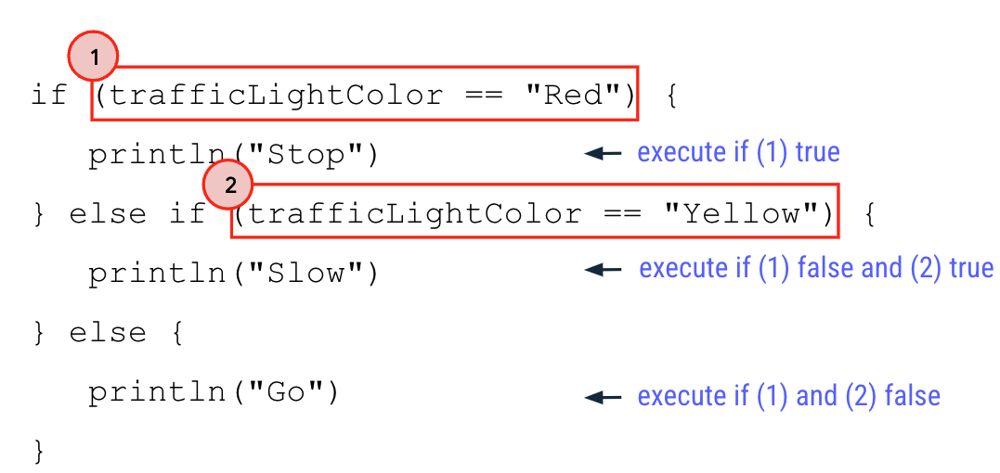

Lo puedes escribir igual que en Java: 

# `if` simple





````kotlin

fun main() {
    val trafficLightColor = "Red"

    if (trafficLightColor == "Red") {
        
        println("Stop")
      
    }
}

````


# `if ... else ...`



````kotlin
fun main() {
    
    val trafficLightColor = "Red"

    if (trafficLightColor == "Red") {
        
        println("Stop")
      
    } else {
        
        println("Go")
      
    }
  
}

````

# 'if ... else if ... else ...'



````kotlin
fun main() {
    val trafficLightColor = "Yellow"

    if (trafficLightColor == "Red") {
        
        println("Stop")
      
    } else if (trafficLightColor == "Yellow") {
        
        println("Slow")
      
    } else {
        
        println("Go")
      
    }
  
}

````