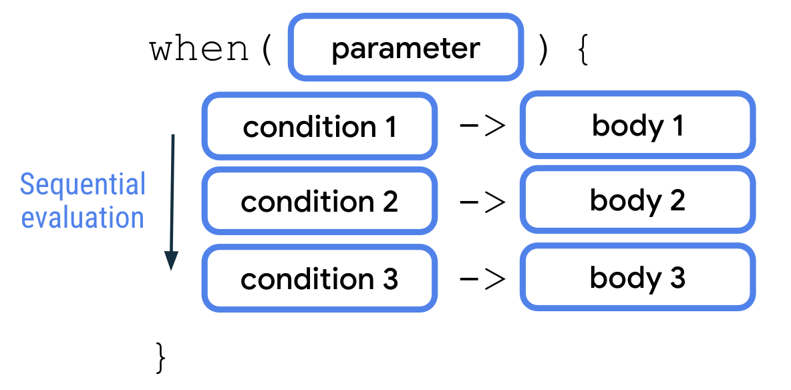
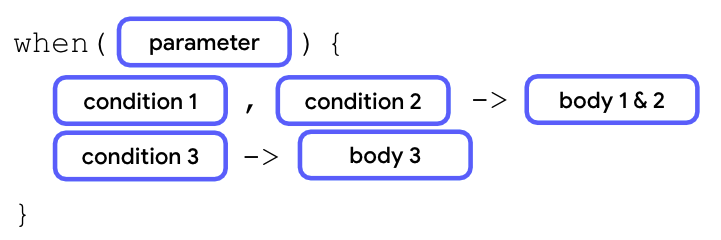
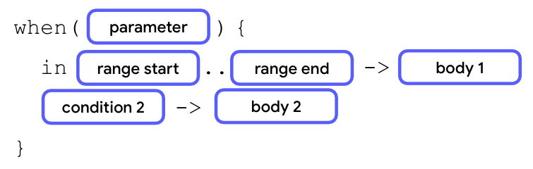
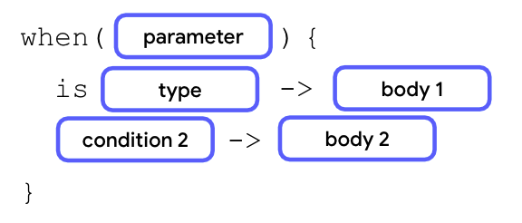

Es equivalente a `switch` en Java, pero tiene una sintaxis enriquecida respecto a este.



Una sentencia `when` acepta un solo valor a través del parámetro. 
Luego, el valor se evalúa frente a cada una de las condiciones de manera secuencial. 
A continuación, se ejecuta el cuerpo de la primera condición que se cumple. 
Cada condición y cuerpo están separados por una flecha (`->`). 
Al igual que con las sentencias `if/else`, cada par de condición y cuerpo se denomina `rama` en las sentencias `when`. 
Del mismo modo que ocurre con la sentencia `if/else`, puedes agregar una rama `else` como tu condición final en una sentencia when que funciona como una rama genérica. Esto es lo que en el `switch` Java escribimos con la palabra `default`.

````kotlin
fun main() {
    val trafficLightColor = "Black"

    when (trafficLightColor) {
        
        "Red" -> println("Stop")
        
        "Yellow" -> println("Slow")
        
        "Green" -> println("Go")
        
        else -> println("Invalid traffic-light color")
        
    }
    
}

````

- Si varias condiciones tienen un mismo resultado,
podemos ponerlas juntas separadas por una coma, antes de la flecha:


````kotlin
fun main() {
    val x = 3

    when (x) {
             
        2, 3, 5, 7 -> println("x is a prime number between 1 and 10.")
       
        else -> println("x isn't a prime number between 1 and 10.")
        
    }
    
}
````

- Si queremos dividir las ramas por rangos de la variable a evaluar, podemos hacerlo así:



````kotlin

fun main() {
    
    val x = 3

    when (x) {
             
        2, 3, 5, 7 -> println("x is a prime number between 1 and 10.")
        
        in 1..10 -> println("x is a number between 1 and 10, but not a prime number.")
        
        else -> println("x isn't a prime number between 1 and 10.")
    }
}

````

- También se puede utilizar la palabra `is` para verificar el tipo de datos del valor que se evalúa:


fun main() {
val x: Any = 4
````java

    when (x) {
    
        2, 3, 5, 7 -> println("x is a prime number between 1 and 10.")
        
        in 1..10 -> println("x is a number between 1 and 10, but not a prime number.")
        
        is Int -> println("x is an integer number, but not between 1 and 10.")
        
        else -> println("x isn't an integer number.")
        
    }
    
}
````

