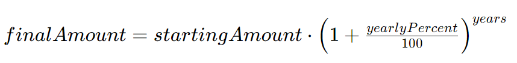

Considere la fórmula de interés compuesto :


Esta ecuación muestra cuánto dinero debería ganar un cliente con un monto inicial determinado , un porcentaje anual y una cantidad de años para mantener un depósito en el banco. Los argumentos más comunes son $1000 para el monto inicial, 5% para el porcentaje anual y 10 años para un depósito.

Uno de los bancos le pide que cree un programa para empleados bancarios. Este programa ayudará a calcular el monto final para parámetros no predeterminados. El empleado ingresará un parámetro que desea cambiar: el nombre del parámetro ( amount, percent, o years) y un nuevo valor para este parámetro. ¡Intente usar parámetros con nombre para resolver este problema!

Necesita crear un programa que lea el nombre y el valor de un nuevo parámetro, calcule el interés compuesto e imprima el monto final para este nuevo parámetro.

# Entrada:
La primera línea de la entrada contiene el parámetro que el cliente modificó: `amount` para el monto inicial, `percent` para el porcentaje anual o `years` para la cantidad de años. La siguiente línea contiene un único número entero: el valor del parámetro.
#Salida: 
La parte entera de la suma.


## Entrada de muestra 1:

````
amount
20000
````
## Ejemplo de salida 1:

````
32577
````

# Entrada de muestra 2:

````
percent
10
````

# Ejemplo de salida 2:

````
2593
````

La solución debe partir (sin borrar nada de lo que está escrito) de este código: 
````kotlin
\\ añade parámetros, tipo de retorno y completa el bloque 
fun interesCompuesto() {
    
}

\\ en el método main() se lee por teclado el parámetro para el que se va a proporcionar un valor distnto al del valor por defecto, y el valor correspondiente
fun main() {
    
}
````