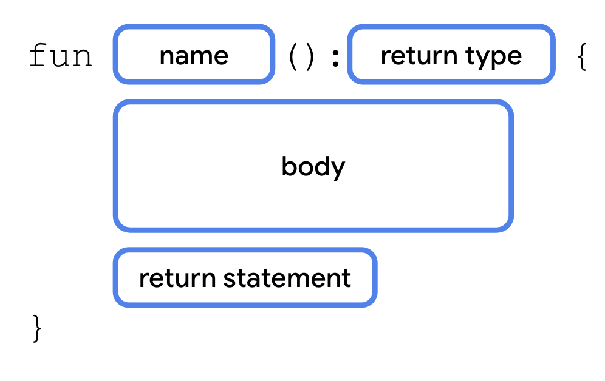
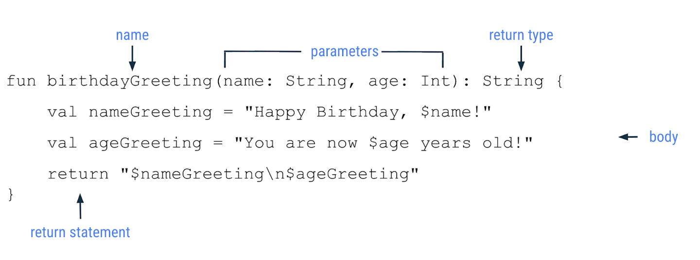

<h1>Cómo definir una función y cómo llamarla</h1>
Antes de explorar las funciones en profundidad, revisemos la terminología básica.

- **Declarar (o definir) una función** usa la palabra clave <code>fun</code> e incluye código dentro de las llaves que contiene las instrucciones necesarias para ejecutar una tarea.
- **Llamar** a una función causa que se ejecute todo el código dentro esta.

Hasta ahora, escribiste todo el código en la función `main()`. En realidad, en ninguna parte del código se llama a la función `main()`; el compilador de Kotlin la usa como punto de partida. 

Si bien Kotlin te permite colocar todo el código en la función main(), lo normal es crear funciones diferentes para tareas específicas, lo cual tiene una serie de beneficios.

- **Código reutilizable:** En lugar de copiar y pegar el código que necesitas usar más de una vez, simplemente puedes llamar a una función cuando sea necesario.
- **Legibilidad:** Garantizar que las funciones realicen una única tarea específica permite que otros desarrolladores y compañeros de equipo, así como tú mismo en el futuro, sepan con exactitud qué hace un fragmento de código.
<h1>Sintaxis para definir una función</h1>


La definición de una función comienza con la palabra clave `fun`, seguida del nombre de la función, un conjunto de paréntesis de apertura y cierre, y un conjunto de llaves de apertura y cierre. Entre llaves, se muestra el código que se ejecutará cuando se llame a la función.
````kotlin

fun main() {

    birthdayGreeting()

}

fun birthdayGreeting() {

    println("Happy Birthday, Rover!")
 
    println("You are now 5 years old!")
}

````
En la función `main()` se llama a la función `birthdayGreeting().`

<h1>Cómo devolver un valor de una función</h1>

**Para especificar el tipo de datos del valor que se devuelve**, debes colocar dos puntos (`:`) después de los paréntesis, 
- un solo espacio en blanco y, luego, 
- el nombre del tipo (`Int`, `String`, etc.). 
- A continuación, se coloca un solo espacio entre el tipo de datos que se devuelve y la llave de apertura. 

Dentro del cuerpo de la función, después de todas las sentencias, usa una sentencia `return` para especificar el valor que desea que muestre la función, seguida del valor que quieres que devuelva la función como resultado.
````kotlin
fun main() {

    println(birthdayGreeting()) 

}

fun birthdayGreeting() : String {
    
    return "Happy Birthday, Rover!\nYou are now 5 years old!"
            
}

````

Sintaxis para declarar una función con un tipo de datos que se devuelve



<h1>El tipo Unit</h1>
De forma predeterminada, si no se especifica un tipo de datos a devolver, el predeterminado es <code>Unit</code>.

<code>Unit</code> significa que la función no devuelve ningún valor.

`Unit` es equivalente a los tipos nulos de datos que se muestran en otros lenguajes (`void` en Java y C, tupla vacía `()` en Swift; `None` en Python, etc.). 

Cualquier función que no devuelvee un valor devuelve `Unit` de forma implícita.

Si deseas observar este comportamiento, modifica tu código para que muestre `Unit`.
````kotlin

fun main() {

    birthdayGreeting()

}

fun birthdayGreeting(): Unit {

    println("Happy Birthday, Rover!")

    println("You are now 5 years old!")

}

````
Para las funciones que no muestran nada o que muestran Unit, no necesitas una intrucción `return`.

<h1>Funciones con parámetros</h1>

Un parámetro especifica el nombre de una variable y un tipo de datos que puedes pasar a una función como datos con los que trabajar dentro de esta.

Los parámetros se declaran entre paréntesis después del nombre de la función.

Sintaxis para declarar una función con parámetros y un tipo de datos que se devuelve

Cada parámetro consiste en un nombre de variable y un tipo de datos, separados por dos puntos y un espacio. Si hay varios parámetros, se separan con una coma.

Podemos personalizar (parametrizar) la función anterior para que reciba cualquier nombre para la felicitación:
````kotlin

fun main() {
    println(birthdayGreeting("Rover"))
}

fun birthdayGreeting(name: String): String {
    
    val nameGreeting = "Happy Birthday, $name!"
    
    val ageGreeting = "You are now 5 years old!"
    
    return "$nameGreeting\n$ageGreeting"
    
}


````
<div style="background-color: darkslateblue; border-radius: 15px; padding: 20px;">
**Nota:** Si bien con frecuencia los usas de forma indistinta, un parámetro y un argumento no son lo mismo. Cuando se define una función, se definen los parámetros que se le pasarán cuando se la llame. Cuando llamas a una función, debes pasar los argumentos para los parámetros. Los parámetros son las variables a las que puede acceder la función, como una variable name, mientras que los argumentos son los valores reales que pasas, como la string "Rover".
</div>

<div style="background-color: steelblue; border-radius: 15px; padding: 20px;">
**Advertencia:** A diferencia de algunos lenguajes, como Java, en los que una función puede cambiar el valor que se pasa a un parámetro, los parámetros en Kotlin son inmutables. No puedes reasignar el valor de un parámetro desde el cuerpo de la función.
</div>

<h1>Funciones con varios parámetros</h1>


Las definiciones de los parámetros están separadas con comas. De manera similar, cuando llamas a una función con varios parámetros, también separas los argumentos que se pasaron con comas.

````kotlin
fun main() {
    println(birthdayGreeting("Rover", 5))
    println(birthdayGreeting("Rex", 2))
}

fun birthdayGreeting(name: String, age: Int): String {
    val nameGreeting = "Happy Birthday, $name!"
    val ageGreeting = "You are now 5 years old!"
    return "$nameGreeting\n$ageGreeting"
}
````

En resumen: 


<h1>Argumentos con nombre</h1>

En los ejemplos anteriores, no tuviste que especificar los nombres de los parámetros, `name` o `age`, cuando llamaste a una función. 
Sin embargo, podrás hacerlo si así lo decides. 
Por ejemplo, **puedes pasar los argumentos en un orden diferente**; por ejemplo, colocar el parámetro `age` antes del parámetro `name`. En ese caso tienes que escribir los nombres de los argumentos en la llamada al método. Por ejemplo, colocamos el argumento con nombre age antes del argumento con nombre name.
````kotlin
println(birthdayGreeting(age = 2, name = "Rex"))
````
<h1>Argumentos predeterminados</h1>

Cuando llamas a una función, puedes decidir omitir los argumentos para los que haya un valor predeterminado, en cuyo caso se usa el predeterminado añadiendo un operador de asignación `=` después del tipo de dato del parámetro.
Ejemplo: 
````kotlin
fun birthdayGreeting(name: String = "Rover", age: Int): String {
return "Happy Birthday, $name! You are now $age years old!"
}
````
Al haber puesto un valor por defecto `"Rover"` al parámetro `name`, podemos llamar a la función birthdayGreeting sólo con el argumento para `age`, porque para `name` utilizará el valor predeterminado `"Rover"`.

````kotlin

fun main() {
    println(birthdayGreeting(age = 5))
}

fun birthdayGreeting(name: String = "Rover", age: Int): String {
return "Happy Birthday, $name! You are now $age years old!"
}
````
<h1>Resumen</h1>

- Las funciones se definen con la palabra clave fun y contienen fragmentos de código reutilizables.
- Las funciones facilitan el mantenimiento de los programas más grandes y evitan la repetición innecesaria de código.
- Las funciones pueden mostrar un valor que puedes almacenar en una variable para usarlo más tarde.
- Las funciones pueden tomar parámetros, que son variables disponibles dentro del cuerpo de una función.
- Los argumentos son los valores que pasas cuando llamas a una función.
- Puedes nombrar argumentos cuando llamas a una función. Cuando usas argumentos con nombre, puedes reordenarlos sin afectar el resultado.
- Puedes especificar un argumento predeterminado que te permita omitirlo cuando llames a una función.