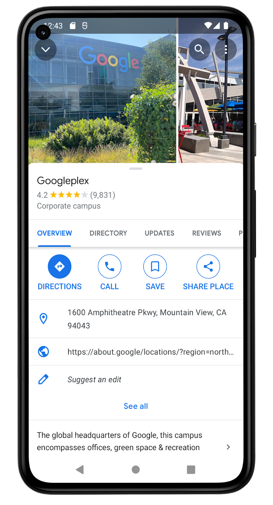
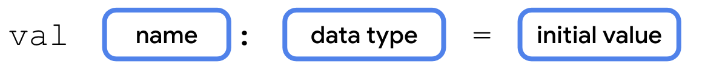
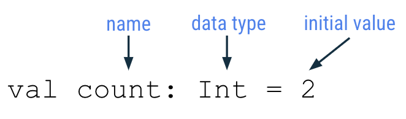
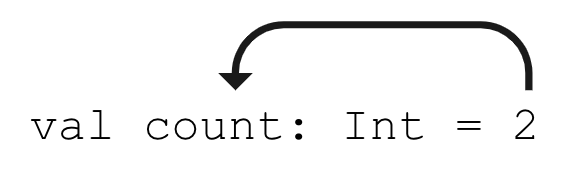
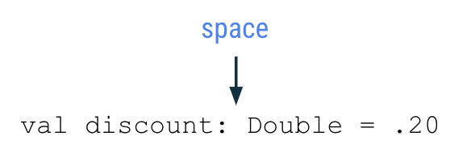
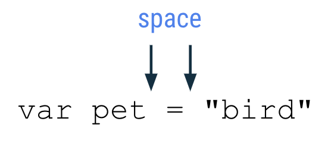
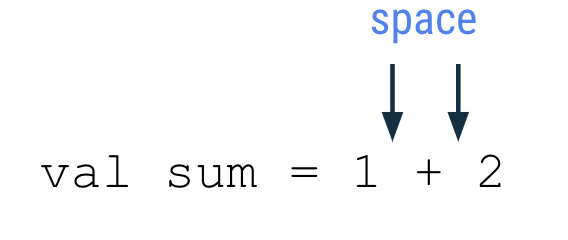

<h1>App de ejemplo con variables</h1>
Observemos un ejemplo de una app para ver dónde podría usar variables.

<div style="text-align: center;"></div>

Esta captura de pantalla de la app de Google Maps muestra los detalles de la ubicación de **Googleplex**. 

- Es un campus corporativo y se describe como la sede central global de Google.

- El sitio tiene una **calificación** de 4.2 estrellas a partir de 9.831 opiniones. 
- Google Maps nos ubica el lugar en 1600 Amphitheatre Pkwy, Mountain View, CA 94043. 
- Esta pantalla permite al usuario guardar la ubicación en sus **favoritos**.
La captura de pantalla muestra los detalles de la sede central de Google, que se denomina Googleplex. 
- ¿Qué datos crees que se almacenan como variables en la app?

- El nombre de la ubicación
- La calificación por estrellas de la ubicación
- La  cantidad de opiniones de la ubicación
- Si el usuario guardó (o agregó a favoritos) esta ubicación
- La dirección de la ubicación
- La descripción de la ubicación
Si cambias los datos que se almacenan en estas variables, tendrás una app de mapas lo suficientemente flexible como para mostrar los detalles de otras ubicaciones.

<h1>Tipos de datos</h1>
Cuando decidas qué aspectos de tu app pueden ser variables, es importante que especifiques qué tipo de datos se pueden almacenar en esas variables. En Kotlin, existen algunos tipos de datos básicos comunes. En la siguiente tabla, se muestra un tipo de datos diferente en cada fila. Para cada tipo de datos, se incluye una descripción del tipo de datos que puede contener y valores de ejemplo.

| Tipo de datos de Kotlin | Qué tipo de datos puede contener | Ejemplos de valores literales |
|-------------------------|---------------------------------|-------------------------------|
| String                  | Texto                           | "Add contact", "Search", "Sign in" |
| Int                     | Número entero                   | 32, 1293490, -59281           |
| Double                  | Número decimal                  | 2.0, 501.0292, -31723.99999   |
| Float                   | Número decimal (que es menos preciso que un Double). Tiene un f o F al final del número. | 5.0f, -1630.209f, 1.2940278F |
| Boolean                 | true o false. Usa este tipo de datos cuando solo haya dos valores posibles. Ten en cuenta que true y false son palabras clave en Kotlin. | true, false |


Ahora que conoces algunos tipos de datos de Kotlin comunes, ¿qué tipo de datos sería el adecuado para cada una de las variables identificadas en la página de detalles de la ubicación que viste antes?


- El **nombre** de la ubicación es texto, por lo que se puede almacenar en una variable cuyo tipo de datos es `String`.
- La **calificación** por estrellas de la ubicación es un número decimal (como 4.2 estrellas), por lo que se puede almacenar como `Double`.
- La **cantidad de opiniones** de la ubicación es un número entero, por lo que debe almacenarse como `Int`.
- **Si el usuario guardó esta ubicación** solo tiene dos valores posibles (guardada o no guardada), por lo que se almacena como `Boolean`, donde true y false pueden representar cada uno de esos estados.
- La **dirección** de la ubicación es texto, por lo que debe ser `String`.
- La **descripción** de la ubicación también es texto, por lo que debe ser `String`.
- 
A continuación, puedes practicar en dos situaciones más. Identifica el uso de las variables y sus tipos de datos en las siguientes apps.

En una app para mirar videos, como la app de **YouTube**, hay una pantalla de detalles del video. ¿Dónde es probable que se usen las variables? ¿Cuál es el tipo de datos de esas variables?

No hay una sola respuesta correcta, pero en una app de reproducción de video, se pueden usar variables para los siguientes datos:

- Nombre del video (String)
- Nombre del canal (String)
- Cantidad de vistas del video (Int)
- Cantidad de "me gusta" en el video (Int)
- Cantidad de comentarios publicados en el video (Int)

En una app de correo electrónico como **Gmail**, la pantalla de **Recibidos** indica los mensajes de correo electrónico más recientes. ¿Dónde es probable que se usen las variables? ¿Cuál es el tipo de datos de esas variables?

Una vez más, no hay una sola respuesta correcta. En una app de correo electrónico, las variables se pueden usar para los siguientes datos:

- Nombre del remitente (String)
- Asunto del correo electrónico (String)
- Si el correo electrónico está destacado (Boolean)
- Cantidad de correos electrónicos nuevos en Recibidos (Int)

#### Pruébalo
1. Abre tu app favorita en el teléfono.
2. Identifica dónde crees que se usan las variables en la app, en esa pantalla en particular.
3. Adivina qué tipo de datos son esas variables.
Comparte tus respuestas en las redes sociales con una captura de pantalla de la app, una explicación de dónde crees que se usan las variables y el hashtag #AndroidBasics.

<h1>Declara y usa variables</h1>

<h2>Declaración de variables</h2>





- Para definir una nueva variable, comienza con la palabra clave val de Kotlin (que significa valor). Luego, el compilador de Kotlin sabe que en esta declaración hay una declaración de variable.
- En la declaración de variables, el nombre de la variable sigue a la palabra clave val. La primera palabra del nombre de variable se escribe en minúscula. Si el nombre contiene varias palabras, no se escriben espacios entre ellas y todas las demás palabras deben comenzar con mayúscula.
- Después del nombre de la variable, agrega dos puntos, un espacio y, luego, el tipo de datos de la variable. 
- El signo igual (=) sigue al tipo de datos. Se denomina `operador de asignación`. El operador de asignación asigna un valor a la variable. En otras palabras, el valor del lado derecho del signo igual se almacena en la variable del lado izquierdo del signo igual.

- A continuación se escribe el valor inicial (inicialización de la variable)

````java
val count: Int = 2
````
Una vez declarada una variable, podemos utilizarla a lo largo del programa.

<h1>Reasignación de variables</h1>

Cuando una app se ejecuta, es posible que sea necesario actualizar el valor de una variable. Por ejemplo, en una app de compras, a medida que el usuario agrega artículos al carrito, el total del carrito aumenta. con lo que necesitarás cambiar cada vez el valor de la variable en que hayas guardado ese valor total.

Cuando se necesita actualizar, reasignar, cambiar el valor de una variable, es necesario decararla con la palabra clave `var` en lugar de `val`. De esta forma hacemos que esta variable sea `mutable`, lo que significa que el valor se puede cambiar o modificar.

<div style="background-color: darkslategrey; border-radius: 15px; padding: 20px;">
<em>Nota</em>: Si estás familiarizado con otros lenguajes de programación, declarar un val es como declarar un valor constante porque es una variable de solo lectura. Hay convenciones adicionales que se deben seguir cuando se declaran constantes en Kotlin.
</div>

<h1>Operadores de incremento <code>++</code> y decremento <code>--</code></h1>

Igual que en Java

<h1>Convenciones de codificación</h1>

- Los nombres de las variables deben seguir la convención de mayúsculas y minúsculas, y comenzar con una letra minúscula.
- En una declaración de variable, debes especificar un espacio después de los dos puntos cuando se especifica el tipo de datos.


- Debe haber un espacio antes y después de un operador como la asignación (`=`), la suma (`+`), la resta (`-`), la multiplicación (`*`) la división (`/`) y muchos más.





- A medida que escribes programas más complejos, se recomienda usar un límite de 100 caracteres por línea. De esta manera, te aseguras de poder leer todo el código de un programa fácilmente en la pantalla de la computadora, sin necesidad de desplazarse horizontalmente cuando leas código.

<h1>Comentarios</h1>

Igual que en Java